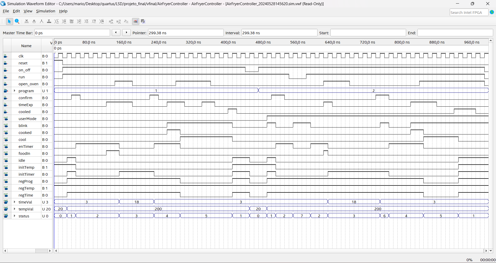
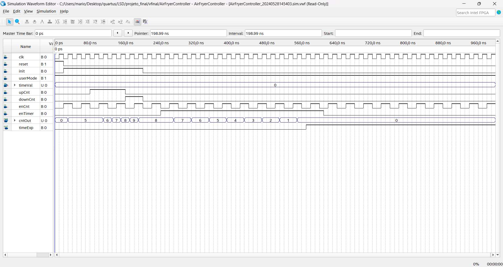
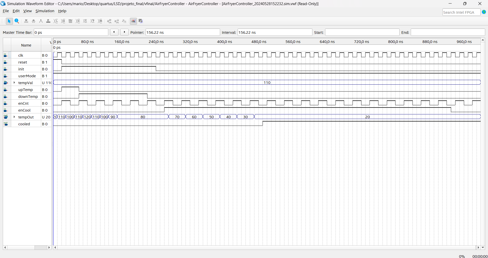

# AirFryer Controller – FPGA Project

# Index

1. [Author](#Author)
2. [Introduction](#introduction) 
3. [Features](#features)  
4. [Block Diagram](#block-diagram)  
5. [Inputs](#inputs)  
6. [Outputs](#outputs)  
7. [Program Definitions](#program-definitions)  
8. [State Machine Diagram](#state-machine-diagram)  
9. [PROCESS](#process)  
   - [Normal Mode](#normal-mode)  
   - [USER MODE](#user-mode)  
10. [Demonstration Video](#demonstration-video)  
11. [Notes on Process Behavior](#notes-on-process-behavior)  
12. [Circuit Implementation Notes](#circuit-implementation-notes)
13. [Simulation](#simulation)

---

## Author

This project was completed as part of the **Digital Systems Laboratory** course in the **1st Cycle Degree in Computer and Informatics Engineering** at the **University of Aveiro** by:
**Mario Silva**

---

## Introduction

This project implements a digital control system for an AirFryer using an FPGA. It is based on a finite state machine (FSM) architecture that manages cooking programs, either predefined or user-configurable.

The system is organized into one main controller FSM (`AirFryerFSM`) and two auxiliary logic blocks:
- `TimerAux` – responsible for countdown timing during cooking phases.
- `TempAux` – responsible for verifying the cooling process and temperature thresholds.

Although these auxiliary blocks are not FSMs themselves, they are essential for the FSM to function correctly, as they provide key signals (`TimeExp`, `cooled`) that drive transitions between cooking states.

This modular design results in a **partitioned control architecture**, where the main FSM delegates specific functionalities to dedicated support logic modules, ensuring better modularity, readability, and reusability.

The system was developed using VHDL, simulated in Quartus, and tested on a Terasic DE2-115 development kit.

---

## Features

- **Input Controls:** Switches and buttons to select mode, adjust time/temperature, and control the oven door.  
- **Outputs:** LEDs and 7-segment displays showing system status, temperature, time, and active program.  
- **Subsystems:** Timekeeping, cooling, and user interaction modules ensure safe and accurate operation.

---

## Block Diagram

---

## Inputs

| Input      | Description                                                  |
|------------|--------------------------------------------------------------|
| `SW(0)`    | ON_OFF                                                       |
| `SW(1)`    | RUN                                                          |
| `SW(2)`    | OPEN_OVEN                                                    |
| `SW(3)`    | **Visual spacer (no function)**                              |
| `SW(6..4)` | Program number (3-bit input)                                 |
| `SW(7)`    | Confirm (goes through the debouncer; works as a button)     |
| `SW(8)`    | **Visual spacer (no function)**                             |
| `SW(9)`    | Global reset                                                 |
| `KEY(0)`   | Increase time                                                |
| `KEY(1)`   | Decrease time                                                |
| `KEY(2)`   | Increase temperature                                         |
| `KEY(3)`   | Decrease temperature                                         |

---

## Outputs

| Output       | Description                                                  |
|--------------|--------------------------------------------------------------|
| `LEDR(2..0)` | STATUS (indicates the FSM state)                             |
| `LEDG(0)`    | `food_in` (signal to insert the food)                        |
| `LEDG(1)`    | `cooked` (indicates that cooking time has ended)            |
| `LEDG(2)`    | `cooled` (indicates the AirFryer has cooled down)           |
| `LEDG(3)`    | `open_oven` (directly mapped to `SW(2)`)                    |
| `HEX0-HEX2`  | Temperature in decimal                                       |
| `HEX4-HEX5`  | Time in decimal                                              |
| `HEX6`       | Selected program                                             |

---

## Program Definitions

| Program | Name            | Preheat Time | Cook Time | Temperature |
|---------|-----------------|--------------|-----------|-------------|
| 0       | Invalid         | -            | -         | -           |
| 1       | DEFAULT         | 3 min        | 18 min    | 200 ºC      |
| 2       | USER MODE       | -            | -         | -           |
| 3       | RISSÓIS         | 3 min        | 15 min    | 180 ºC      |
| 4       | BATATAS         | 5 min        | 20 min    | 200 ºC      |
| 5       | FILETES         | 3 min        | 20 min    | 170 ºC      |
| 6       | HAMBURGER       | 5 min        | 20 min    | 170 ºC      |
| 7       | BOLO DE CENOURA | 4 min        | 18 min    | 160 ºC      |

The program signal is 3 bits wide.  
Program 2 corresponds to USER MODE.

---

## State Machine Diagram

---

## PROCESS

### Normal Mode

The AirFryer starts in state 0 `OFF`. Once turned on with `SW(0)`, it transitions to state 1 `IDLE`. In this state, the user must choose one of the 7 available programs. Program 0 is invalid, so the selection must be between 1 and 7.

Program 2 is USER MODE, allowing the user to select a custom temperature between 80–220 ºC and time between 1–30 minutes.

Program selection can only occur in the `IDLE` state, since `SW(6..4)` are registered via a synchronous register controlled by the clock (`CLOCK_50`) and an enable signal (`idle`) from the FSM indicating the current state is `IDLE`.

If a valid program (other than 2) is selected, the user must:

- Turn on `RUN` (`SW(1)`).
- Confirm the program via `SW(7)` (goes through `DebounceUnit` and generates a pulse).
- Ensure `SW(2)` (`OPEN_OVEN`) is OFF (i.e., the basket is inside).

Then the FSM transitions to state 2 `PREHEAT`. A countdown starts via `TimerAuxFSM`. When time expires (`TimeExp = 1`), `LEDG(0)` is lit (insert food). The user should now remove the basket (`SW(2) = 1`), causing the FSM to enter state 3 `OPENED`.

After placing the food, the basket should be reinserted (`SW(2) = 0`) and confirmed again with `SW(7)`.

The FSM then moves to state 4 `COOK`. The cooking countdown begins, and upon completion, `LEDG(1)` (`cooked`) is activated. The user removes the basket (`SW(2) = 1`), transitioning to state 5 `COOL`.

In `COOL`, `TempAuxFSM` handles cooling until 20 ºC is reached. It then sends a brief `cooled` signal (20 ns), which triggers the `TimerNDes` to show `LEDG(2)` for 2 seconds. Then the FSM returns to `IDLE`.

---

### USER MODE

If program 2 is selected:

- In `IDLE`, the user configures:
  - Preheat temperature via `KEY(2)`/`KEY(3)` (80–220 ºC)
  - Preheat time via `KEY(0)`/`KEY(1)` (1–30 minutes)

- After confirming with `SW(7)`, the FSM moves to `PREHEAT`.

- Once the timer expires, `LEDG(0)` is activated. The user removes the basket (`SW(2) = 1`), and FSM goes to state 3 `OPENED`.

- After inserting the food and confirming again (`SW(7)`), FSM enters state 6 `USERCOOKTIME`.

- The user sets cook time (`KEY(0)`/`KEY(1)`) and confirms (`SW(7)`). The FSM then transitions to `COOK`, following the normal process until it returns to `IDLE`.

## Demonstration Video

The following video demonstrates the AirFryer control system running on the Terasic DE2-115 FPGA board. It shows the transition between system states, user interaction through switches and buttons, and visual outputs on the 7-segment display and LEDs.

---

## Notes on Process Behavior

- Throughout the process (from `IDLE` until returning to it), `SW(1)` (`RUN`) must remain ON.

- If `RUN` is turned OFF or the basket is removed in an invalid state (e.g., `PREHEAT` or `COOK`), the FSM transitions to state 7 `STOPPED`:
  - Countdown pauses.
  - `blink` signal is activated for `LEDR(2..0)` and HEX displays.
  - When the condition is resolved (`RUN` ON or basket reinserted), the FSM resumes the previous state, tracked via `s_previousState`.

- If `SW(0)` (`ON_OFF`) is turned OFF during any state, the FSM immediately transitions to `COOL`, and then to `OFF` (state 0).
  - If OFF is triggered from `IDLE`, it goes directly to `OFF` (no need to cool down).

---

## Circuit Implementation Notes

- All synchronous components use a 50 MHz clock (`CLOCK_50`).

- `SW(9)` is a global reset. When `SW(9) = 1`, all synchronous components (including FSMs) are reset.

- The system includes a main FSM (`AirFryerFSM`) and two sub-FSMs:
  - `TimerAuxFSM`
  - `TempAuxFSM`

- Sub-FSMs and `PulseGenerator` operate on the inverted clock (`NOT CLOCK_50`), as per lecture 9 recommendations.

- All switches except `SW(7)` are passed through the `SyncSWReg`. `SW(7)` and `KEY(3..0)` go through the `DebounceUnit`.

- The `PulseGenerator` is used to generate a 1 Hz pulse for countdown timers (`TimerAuxFSM` and `TempFSM`).

- `SW(6..4)`, after passing through `SyncSWReg`, are further registered with enable controlled by the FSM’s `idle` output, locking in the program selection.

- `TimerNDes` extends the `cooled` signal duration to 2 seconds (`N = 100_000_000`) for visibility on `LEDG(2)`.

- The `blink` signal controls the `BLINK` component, which manages the blinking of `LEDR(2..0)` and HEX displays (except `HEX6`).
  - A `FreqDividerK` generates a 2 Hz clock for this purpose (LEDs blink 2 times per second).

- Outputs `CntOut`, `TempOut`, and `ProgramSelected` from `TimerAuxFSM`, `TempAuxFSM`, and `ProgramReg` are fed to:
  - `BIN2BCD8_8` and `BIN2BCD8_12` (BCD encoders)
  - `BIN7SEGDECODER` (7-segment decoders)
  - Each decoder has an `EN` input, controlled by `AirFryerFSM` signals (`RegTime`, `RegTempo`, `RegProg`) to enable display depending on the state.

---

## Simulation

To validate the behaviour of the system, simulation was performed using **Quartus Prime** and its **University Program VWF (Vector Waveform File)** tool. This allowed for functional verification of the main FSM and the two auxiliary logic blocks under different conditions and inputs.

Below are the simulation results of each module:

### Simulation of `AirFryerFSM`  
This waveform demonstrates the state transitions and output signals of the main FSM responsible for managing the Air Fryer's operation.

### Simulation of `TimerAux` block  
This waveform illustrates the timer management logic, which runs on the negated clock and exchanges signals with the main FSM, providing key timing signals for cooking phases.

### Simulation of `TempAux` block  
This waveform shows the temperature control logic, also running on the negated clock and interacting with the main FSM by signalling cooling and temperature threshold events.

